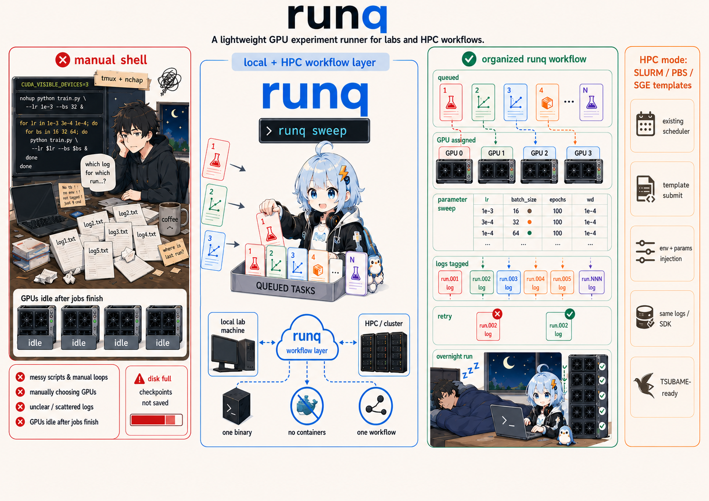

# runq-lab

A sweep-first experiment runner for research labs — local machines and HPC
clusters, same commands.



## The problem

If your lab's GPU workflow looks like this:

```bash
export CUDA_VISIBLE_DEVICES=3
nohup python train.py --lr 0.001 --batch_size 32 > log1.txt &
# wait... check... done?
export CUDA_VISIBLE_DEVICES=3
nohup python train.py --lr 0.01 --batch_size 32 > log2.txt &
# repeat 4 more times, Ctrl+C when something goes wrong
# go to bed, wake up to 6 hours of idle GPUs
# next morning: which log was the lr=0.01 run again?
```

Or on an HPC cluster:

```bash
for lr in 0.001 0.01 0.1; do
  for bs in 32 64; do
    sed "s/{{LR}}/$lr/g; s/{{BS}}/$bs/g" submit.sh.tmpl > submit_${lr}_${bs}.sh
    qsub submit_${lr}_${bs}.sh
  done
done
# 6 scripts, 6 qsub calls, hope you didn't typo the template
```

runq turns both into:

```bash
runq sweep lr=0.001,0.01,0.1 batch_size=32,64
# 6 tasks queued. GPUs assigned. Failures retried. You go to sleep.
```

No containers, no cluster admin. Each task gets its own log, tagged with the
exact parameters that produced it.

## How it compares

| | runq-lab | tmux + nohup | SLURM / PBS |
|---|---|---|---|
| Setup | `runq` client + `runqd` on the GPU host | Already there | Need a cluster admin |
| GPU assignment | Automatic, no conflicts | Manual `CUDA_VISIBLE_DEVICES` | Automatic |
| Parameter sweep | One command or YAML | Hand-written for loop | sbatch arrays |
| "Which log had lr=0.01?" | `runq task show <id>` | Good luck | Job name conventions |
| Task fails at 3 AM | Auto-retry, next task starts | Dead. GPUs idle till morning | Depends on config |
| Lab has 3 users | One visible queue | "Hey, are you using GPU 2?" | Built-in, but overkill |
| Works on HPC | Yes — same workflow, target mode | No | It *is* SLURM |

runq-lab fills the gap between "everyone just runs stuff manually" and "we
need a full cluster scheduler." It also works *on top of* SLURM, PBS, and
SGE: runq handles sweep expansion, param injection, and log management; the
cluster's own scheduler keeps scheduling.

## Architecture

runq-lab is two independent programs:

- **`runq`** — the client and experiment coordinator. Cross-platform
  (Linux / macOS). Manages projects, expands sweeps, routes to targets,
  serves the optional web dashboard.
- **`runqd`** — the machine execution daemon. Linux-only. Owns the GPU
  queue, process lifecycle, and recovery on one machine.

Neither embeds the other. `runq` talks to `runqd` over a Unix socket for
local execution, and to HPC clusters over SSH. macOS users run `runq`
locally and point it at a remote Linux `runqd` or an HPC target.

## Install

```bash
curl -fsSL https://raw.githubusercontent.com/Gliese129/runq-lab/main/install.sh | sh
```

The installer detects Linux/macOS and amd64/arm64, asks whether to install
the embedded web UI, verifies SHA-256 checksums, and atomically installs or
updates only `runq`. Existing configuration and database files are untouched.

For automation:

```bash
curl -fsSL https://raw.githubusercontent.com/Gliese129/runq-lab/main/install.sh \
  | RUNQ_WITH_UI=1 RUNQ_VERSION=v0.5.0 sh
```

| Env var | Effect |
|---|---|
| `RUNQ_WITH_UI=0\|1` | Skip the UI prompt |
| `RUNQ_START_DAEMON=1` | Start the client daemon after install |
| `RUNQ_INSTALL_DIR=…` | Custom install path |
| `RUNQ_VERSION=v…` | Pin a release version |

By default an update replaces only the binary; an already-running client
daemon keeps running until you restart it. Set `RUNQ_START_DAEMON=1` when
installing to start or restart that daemon after the verified replacement.

### Release artifacts

| Artifact | What | When you need it |
|---|---|---|
| `runq-{linux,darwin}-{amd64,arm64}` | CLI / client core | Always |
| `runq-dashboard-{linux,darwin}-{amd64,arm64}` | CLI with web dashboard embedded | You want a GUI |
| `runq-sdk` on PyPI | Python SDK | Metrics / checkpoints in training code |

Install `runqd` from the
[`runq-executor`](https://github.com/Gliese129/runq-executor) repository on
every Linux GPU host. Check client setup with `runq doctor`, and execution
readiness with `runqd health`.

## Quickstart — local GPU machine

```bash
# 1. Start services
runqd serve                 # on the GPU host (normally via systemd)
runq target add local       # opt this client into local execution
runq daemon start -d        # client daemon (background)

# 2. Set up a project
cd ~/experiments/resnet50
runq init train.py          # scans argparse → project.yaml + job.yaml
runq project add .          # register it

# 3. Submit
runq submit job.yaml --dry  # preview the expansion — nothing submitted
runq submit job.yaml        # go
```

Or skip YAML entirely:

```bash
runq sweep lr=1e-3,1e-2 batch_size=32,64
```

Then monitor:

```bash
runq ps                     # job table
runq ps <job_id>            # that job's tasks
runq gpu                    # per-GPU allocation
runq logs <task_id>         # tail + follow (--no-follow to print and exit)
runq best <job_id> --key val_loss     # best task by metric
```

Full walkthrough: [docs/getting-started.md](./docs/getting-started.md)

## Quickstart — HPC cluster (SLURM / PBS / SGE)

runq compiles your sweep, writes per-task workspaces, and delegates
scheduling to the cluster's native job manager.

```bash
runq target add tsubame --template=tsubame --host=login.t4.gsic.titech.ac.jp --user=alice
runq target check tsubame   # validate templates — free
runq connect tsubame        # verify SSH, install remote CLI, start forward

runq submit job.yaml -t tsubame --dry
runq submit job.yaml -t tsubame
```

After `target add`, customise `submit_template` / `submit_id_regex` /
`kill_template` in `~/.runq/config.yaml` for your cluster. Presets for
SLURM, PBS, SGE, TSUBAME, and ABCI are included.

Details: [docs/hpc.md](./docs/hpc.md)

## Everyday commands

```bash
runq ps [job_id]             # jobs, or one job's tasks
runq status [job_id]         # daemon / queue summary
runq logs <task_id>          # tail + follow
runq kill <task_id|job_id>   # stop a task or job
runq task retry <task_id>    # requeue a failed task
runq job pause|resume <id>   # stop / resume dispatching
runq job archive <id>        # hide from lists (reversible)
runq clean --show            # preview cleanup (runq clean deletes IRREVERSIBLY)
```

Every read command supports `--json`. Job ids look like `jb…`, task ids
like `tk…`.

Complete reference: [docs/cli.md](./docs/cli.md)

## Configuration

Two files, one rule:

- **project.yaml** — the parameter *catalog*: everything that can vary,
  with types and defaults.
- **job.yaml** — one *selection*: what varies this time.

```yaml
# project.yaml
project_name: resnet50
working_dir: /home/user/experiments/resnet50
command_template: python train.py {{args}}
environment:
  WANDB_PROJECT: resnet-experiments
params:
  - { name: lr, type: float, default: 0.001 }
  - { name: optimizer, type: str, default: adam, choices: [adam, sgd], strict: true }
defaults:
  gpus_per_task: 1
  max_retry: 3
```

```yaml
# job.yaml
project: resnet50
sweep:
  - method: grid
    parameters: { lr: [0.001, 0.01, 0.1], optimizer: [adam, sgd] }
  - method: list
    parameters: { batch_size: [32, 64], num_workers: [4, 8] }
# grid(3×2) × list(2) = 12 tasks
```

`project.yaml` is the source of truth — hand-edits are picked up on the
next use; CLI and dashboard can never disagree. Secrets go in
`working_dir/.env`, sourced at task start, never stored by runq.

Full reference: [docs/configuration.md](./docs/configuration.md) ·
Copy-paste starters: [examples/](./examples/)

## Python SDK

`pip install runq-sdk` integrates with your training script.

```python
import runq

@runq.dataclass(auto_overwrite=True)
class Params:
    lr: float = 0.001

cfg = Params()                       # sweep params merged in
for step in runq.range(1000):        # preemption + early-stop aware
    runq.log_metric("loss", train_step(cfg))
    runq.safe_save("ckpt.pt", model.state_dict(), keep_last_n=3)
```

Features: typed param auto-merge from sweeps, `log_metric()` (feeds
`runq best`), atomic `safe_save()` checkpoints with ENOSPC freeze,
cooperative preemption, early stopping with pluggable policies
(`patience`, `threshold`, `convergence`). Works in daemon mode, file-only
mode (HPC), or standalone with no runq infrastructure.

SDK reference: [docs/sdk_reference.md](./docs/sdk_reference.md) ·
Examples: `sdk/python/examples/`

## Scheduling and reliability

runq-lab dispatches in FIFO order and enforces each target's
`max_inflight` limit. GPU placement and process isolation belong to runqd
(local) or the cluster scheduler (HPC).

Built for the "submit before going home" workflow: durable pre-submit
intent, auto-retry up to `max_retry`, optional per-task timeout, and
crash recovery from durable state. A lost submit response becomes
`unknown` instead of being silently retried into a duplicate.

## For scripts and agents

- Every read command supports `--json` for structured output.
- `runq sweep` without `--dry` mutates the queue — never use it to
  explore.
- `runq logs` follows by default — always pass `--no-follow` in scripts.
- `runq clean` is irreversible — preview with `--show` first.
- `runq submit --dry` is free and side-effect-free.

## Documentation

| Doc | Audience |
|---|---|
| [docs/getting-started.md](./docs/getting-started.md) | First sweep in 5 minutes |
| [docs/concepts.md](./docs/concepts.md) | How runq-lab thinks: projects, jobs, tasks, targets |
| [docs/dfa-ir.md](./docs/dfa-ir.md) | Transition-function audit projection and resolved state issues |
| [docs/repository-split.md](./docs/repository-split.md) | runq-lab / runq-executor authority and release boundary |
| [docs/configuration.md](./docs/configuration.md) | project.yaml / job.yaml full reference |
| [docs/hpc.md](./docs/hpc.md) | HPC targets: setup, templates, login-node behavior |
| [docs/cli.md](./docs/cli.md) | Every command and flag |
| [docs/sdk_reference.md](./docs/sdk_reference.md) | Python SDK API reference |
| [examples/](./examples/) | Annotated config starting points |

## License

[MIT](./LICENSE)
